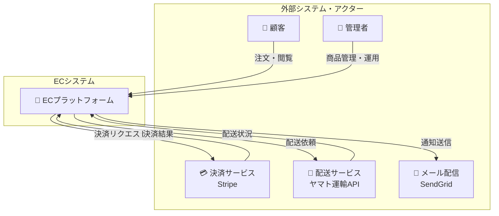

```mermaid
flowchart TB
    subgraph External[外部システム・アクター]
        Customer[👤 顧客]
        Admin[👤 管理者]
        Payment[💳 決済サービス<br/>Stripe]
        Shipping[🚚 配送サービス<br/>ヤマト運輸API]
        Email[📧 メール配信<br/>SendGrid]
    end
    
    subgraph System[ECシステム]
        Core[🛒 ECプラットフォーム]
    end
    
    Customer -->|注文・閲覧| Core
    Admin -->|商品管理・運用| Core
    Core -->|決済リクエスト| Payment
    Core -->|配送依頼| Shipping
    Core -->|通知送信| Email
    Payment -->|決済結果| Core
    Shipping -->|配送状況| Core
```
